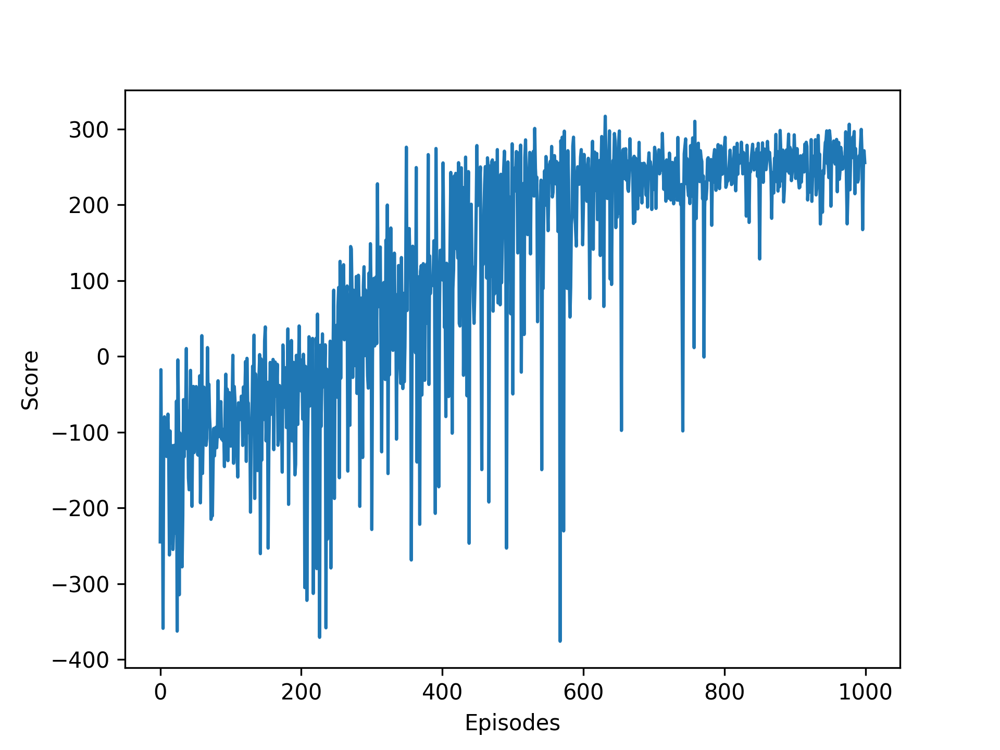

# DQN + LunarLander

Обучение:
```bash
python main.py

> States: 8; Actions: 4
> Episode 100 average score: -115.99486798406855
> Episode 200 average score: -65.84544873242791
> Episode 300 average score: -26.961650859439395
> Episode 400 average score: 20.725459285694214
> Episode 500 average score: 99.92889484071988
> Episode 600 average score: 160.3533932037851
> Task solved with 700 episodes. Average score: 211.47770888095295
```



Тест и примеры полетов:
```bash
python test.py

> Average score: 219.08627640540854
```

